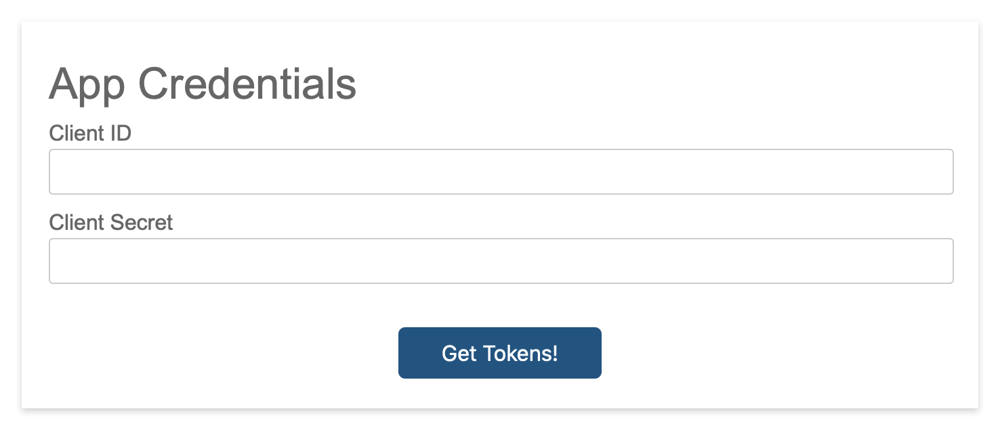

# Internal Slack Oauth

A simple node express app used to simplify the process of obtaining user and bot tokens when installing 
internal slack apps.  

This can be useful, for instance, if you are distributing an app only for the purposes of installing it 
on multiple workspaces within your Grid org.

## Usage

First install node modules

```
npm install
```

Then run, with a single argument for the port
```
node index.js 3000
```

## How To Use

In your slack app configuration, navigate to **Oauth and Permissions**, and add this app's domain and port
with path /add-to-slack (e.g. http://localhost:3000/add-to-slack)

Then you can go to the **Manage Distribution** page, and click the add to slack button, or copy the 
shareable URL.

After **Allow**ing access, you should land on a form served by this app that prompts for Client ID
and Client Secret.  These can be found on your app's **Basic Information** page under
**App Credentials**.



Submitting the form with the correct app credentials will give you access to tokens on the next page.
